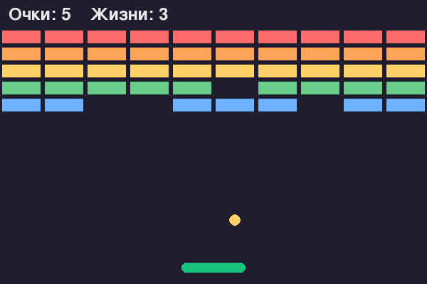

# 🎮 Игры на Python — школьный курс

Сайт-сборник мини-курсов: каждая игра — отдельный курс из нескольких уроков.
Дети читают уроки в браузере и собирают рабочую игру на Python у себя на
компьютере.

👉 Как выложить сайт в интернет (GitHub Pages + свой домен) — в [DEPLOY.md](DEPLOY.md).

---

## Структура

```
index.html              ← главная-каталог: карточки всех игр
start.html              ← «Подготовка»: терминал, Python, VS Code, venv (Ubuntu)
shared.css              ← общий стиль для ВСЕХ курсов (правишь в одном месте)
games/
  snake/                ← одна игра = одна папка
    index.html          ← старт курса (приветствие + список уроков)
    urok1.html … urok7.html
    code/               ← python-файлы: stepN.py + финальная игра
    LESSONS.md          ← методичка для учителя
DEPLOY.md  README.md
.nojekyll  .gitignore
```

**Принцип:** всё про одну игру лежит в `games/<имя>/`. Главная `index.html` — это
просто витрина со ссылками. Чтобы добавить игру, старое трогать не нужно.

---

## Как добавить новую игру

Допустим, добавляем «Арканоид» (`arkanoid`).

**1. Создай папку игры и скопируй змейку как образец:**

```
cp -r games/snake games/arkanoid
```

**2. Перепиши содержимое** `games/arkanoid/`:
- `index.html` — заголовок, описание, карточки уроков;
- `urok1.html …` — сами уроки;
- `code/` — положи туда `.py`-файлы новой игры;
- `LESSONS.md` — методичку.

**3. Проверь относительные ссылки** внутри страниц (менять обычно не нужно):
- на общий стиль: `<link rel="stylesheet" href="../../shared.css">`
- хлебная крошка наверху: `<a class="back" href="../../index.html">🎮 Все игры</a>`
- ссылки между уроками — без папок, просто `urok2.html` (они в одной папке).

**4. Добавь карточку на главной** `index.html`. Найди блок `<div class="cards">`
и вставь:

```html
<a class="card" href="games/arkanoid/index.html">
  
  <h3>🧱 Арканоид</h3>
  <p>Короткое описание игры.</p>
  <span class="meta">5 уроков · готово</span>
</a>
```

**Превью-картинка** (`games/<имя>/preview.png`, 600×400) делает карточку
привлекательнее и показывается ещё в шапке курса (``).
Проще всего получить её скриншотом игры или отрисовать кадр кодом (как сделаны
существующие — см. историю git). Если превью нет — карточку можно оставить с
`<span class="emoji">🎮</span>` вместо ``.

(Карточка-заглушка «скоро» — это `<span class="card soon">…</span>`, она не
кликается. Когда игра готова — меняешь `span` на `a href=...` и убираешь класс
`soon`.)

**5. Включи полный экран в готовой игре** (даёт «эффект настоящей игры»).
В финальном файле игры — две правки, координаты игры (600×400) при этом
не меняются, `pygame.SCALED` всё растягивает сам:

```python
# 1) при создании окна — флаг SCALED и переменная-флаг:
screen = pygame.display.set_mode((WIDTH, HEIGHT))   # окно обычного размера
fullscreen = False

# 2) в цикле событий — F (полный экран) и ESC (выход).
#    Пересоздаём окно с FULLSCREEN — это надёжно работает на macOS/Windows
#    (toggle_fullscreen() на маке часто не срабатывает).
if event.type == pygame.KEYDOWN:
    if event.key == pygame.K_f:
        fullscreen = not fullscreen
        flags = (pygame.SCALED | pygame.FULLSCREEN) if fullscreen else 0
        screen = pygame.display.set_mode((WIDTH, HEIGHT), flags)
    elif event.key == pygame.K_ESCAPE:
        pygame.quit()
        sys.exit()
```

Добавляй это **только в готовую игру** (и в последний урок), а ранние step-файлы
оставляй простыми. В финальном уроке полезно добавить раздел «🖥️ Полный экран»,
а на стартовой странице курса — подсказку «нажми F».

**6. Залей изменения:**

```
git add .
git commit -m "Добавил игру: Арканоид"
git push
```

Сайт обновится сам за минуту.

---

## Полезные классы в `shared.css`

Чтобы уроки выглядели одинаково, используй готовые блоки:

| Класс | Зачем |
|---|---|
| `.lesson-head` + `.eyebrow` | заголовок урока |
| `.goal` | рамка «что ты увидишь» |
| `.box`, `.box.warn`, `.box.idea`, `.box.try` | подсказки (обычная / ошибка / идея / попробуй сам) |
| `pre` + `.kw .str .num .com .fn` | код с подсветкой (фиолетовый/зелёный/оранжевый/серый/синий) |
| `.grid-demo` | ASCII-схемки |
| `.pipe` + `.pill` + `.arrow` | цепочки шагов |
| `.dots` + `.dot.active` | переключатель уроков наверху |
| `.pager` | кнопки «Назад / Дальше» внизу |

---

## Запуск игр локально (для уроков)

```
cd snake
python -m venv .venv
source .venv/bin/activate        # Windows: .venv\Scripts\activate
pip install pygame-ce
python games/snake/code/snake.py
```
